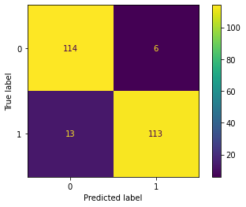
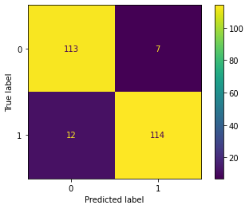
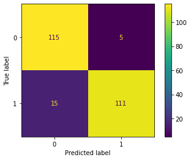
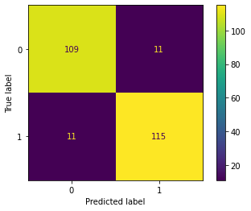

# News Headlines Dataset For Sarcasm Detection

## Dataset
The [dataset](https://www.kaggle.com/datasets/mlg-ulb/creditcardfraud) contains transactions made by credit cards in September 2013 by European cardholders.
This dataset presents transactions that occurred in two days, where we have 492 frauds out of 284,807 transactions. The dataset is highly unbalanced, the positive class (frauds) account for **0.172%** of all transactions.

## EDA
- head
- tail
- info
- describe
- hist

## Cleaning
- Balancing: take equal number of transactions for each class
- Normalization
 
## Train Test Split
Test size: 25%

## LogisticRegression 
- Accuracy of model (recall): **90%**

 

## RandomForestClassifier
- Accuracy of model (recall): **87%**

 

## GradientBoostingClassifier
- Accuracy of model (recall): **90%**

 

## LinearSVC
- Accuracy of model (recall): **88%**

 

## Neural Network
- Accuracy of model (recall): **91%**

 

**fraud_credit_card_unbalanced.ipynb** is the version that i didnt care about balancing number of frauds and non-frauds.

**fraud_credit_card_balanced.ipynb** is the version that number of frauds and non-frauds i have balanced.
